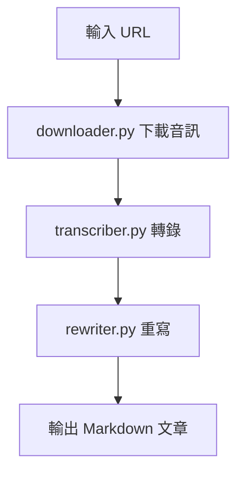

# Project Whisper 專案總結

## 📋 概述

Project Whisper 是一個端到端的音訊處理與 AI 重寫系統，用於將音訊內容自動轉為結構化 Markdown 文章。核心能力：
- 批次下載音訊（YouTube/Podcast 等）
- Whisper 語音轉文字
- 透過 OpenRouter + 可配置 Prompt 進行 AI 重寫
- 智能檔案管理、分類與報告

## 🏗️ 架構與流程



### 主要模組
- `downloader.py`: 下載音訊並記錄已下載/失敗 URL
- `transcriber.py`: 使用 Whisper 進行轉錄，產生 `*_transcript.txt`
- `rewriter.py`: 使用 OpenRouter 依據 `prompt.py` 或 `config/prompts` 重寫為 Markdown（含自動分類與檔名規範）
- `file_manager.py`: 統一路徑、建立/儲存/搬移檔案、關鍵字分類
- `cleaner.py`: 清理舊結構/暫存
- `utils.py`: 通用工具

## 📁 目錄結構

```
project-whisper/
├── data/
│   ├── input/
│   │   ├── urls/                # urls.txt, downloaded_urls.txt, failed_urls.txt
│   │   ├── audio/{raw,processed}
│   │   └── config/
│   ├── output/
│   │   ├── transcripts/{raw,cleaned}
│   │   ├── articles/{finance,technology,education,general}
│   │   └── reports/
│   └── temp/{downloads,processing,cache}
├── config/prompts/{finance,technology,education,general}.txt
├── src/
└── main.py
```

## 🚀 使用

1) 編輯 `data/input/urls/urls.txt`

2) 執行
```bash
python main.py
```

3) 輸出位置
- 轉錄：`data/output/transcripts/raw/`
- 文章：`data/output/articles/<category>/`
- 報告：`data/output/reports/`

常用參數：
- 指定分類/模板：`--category finance --prompt-type finance`
- 跳過下載：`--no-download`
- 僅清理：`--clean-only`
- 自訂 URL 檔：`--batch /path/to/urls.txt`

## ⚙️ 設定重點

`config.ini` 範例（鍵名大小寫不敏感）：

```ini
[OPENROUTER]
API_KEY = your_api_key

[REWRITER]
PROMPT = finance
ENDPOINT = https://openrouter.ai/api/v1/chat/completions
MODEL = deepseek/deepseek-chat-v3-0324:free
auto_categorize_output = true

[transcriber]
model_name = base
```

行為說明：
- Prompt 來源優先序：`src/prompt.py` → `config/prompts/<type>.txt` → `general/finance` 後備
- 每次 API 呼叫後自動冷卻 10 秒，降低 429 風險
- 檔名會截斷原標題至前 15 字，並移除 `_transcript` 後綴
- 未指定 `category` 且開啟自動分類時，依關鍵字分類輸出

## 🧪 測試與日誌

```bash
python test_system.py
```

日誌位於 `logs/`，主流程執行時會自動建立檔案。

## 🆘 故障排除
- 驗證 `config.ini` 的 OpenRouter 金鑰
- 確認網路連線與 API 可用性
- 檢查 `logs/` 內含 ERROR 訊息
- Whisper 模型未安裝時請依 README 指引安裝（含 GPU/ROCm 注意事項）

---

本文件概述系統功能、流程與設定重點，細節以 `README.md` 為準。