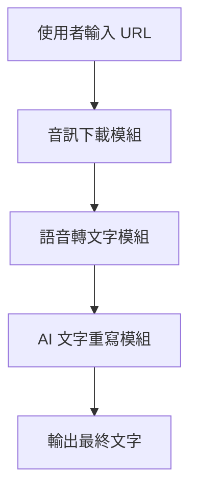

# Project Whisper 專案文檔總結

## 📋 專案概述

**Project Whisper** 是一個功能完整的音訊處理和 AI 文字重寫系統，主要用於：
- 音訊檔案的批次下載
- 語音轉文字處理
- AI 智能文字重寫
- 檔案管理和分類

## 🏗️ 系統架構

### 核心處理流程


### 主要模組
- **downloader.py** - 音訊下載功能
- **transcriber.py** - 語音轉錄功能
- **rewriter.py** - AI 文字重寫功能
- **cleaner.py** - 音訊清理功能
- **file_manager.py** - 檔案管理功能
- **utils.py** - 公用實用函數

## 📁 檔案結構

### 新版檔案結構 (推薦)
```
project-whisper/
├── data/                           # 主要資料目錄
│   ├── input/                      # 輸入檔案
│   │   ├── urls/                   # URL 管理
│   │   │   ├── urls.txt           # 待下載的 URL 清單
│   │   │   ├── downloaded_urls.txt # 已下載的 URL 記錄
│   │   │   └── failed_urls.txt    # 下載失敗的 URL
│   │   ├── audio/                  # 音訊檔案
│   │   │   ├── raw/               # 原始下載的音訊
│   │   │   └── processed/         # 處理過的音訊
│   │   └── config/                 # 批次配置檔案
│   ├── output/                     # 輸出檔案
│   │   ├── transcripts/           # 轉錄文字
│   │   │   ├── raw/              # 原始轉錄
│   │   │   └── cleaned/          # 清理後的轉錄
│   │   ├── articles/              # 重寫後的文章
│   │   │   ├── finance/          # 理財類文章
│   │   │   ├── technology/       # 科技類文章
│   │   │   ├── education/        # 教育類文章
│   │   │   └── general/          # 一般類文章
│   │   └── reports/               # 處理報告
│   └── temp/                       # 暫存檔案
│       ├── downloads/             # 下載中的檔案
│       ├── processing/            # 處理中的檔案
│       └── cache/                # 快取檔案
├── config/                         # 配置檔案
│   ├── prompts/                   # AI 提示模板
│   │   ├── finance.txt           # 理財類提示
│   │   ├── technology.txt        # 科技類提示
│   │   ├── education.txt         # 教育類提示
│   │   └── general.txt           # 一般類提示
│   └── models/                    # 模型配置
├── logs/                          # 日誌檔案
├── src/                           # 原始碼
└── main.py                        # 主程式
```

## 🚀 使用方法

### 基本使用流程
1. **準備 URL 清單**
   ```bash
   # 編輯 URL 清單檔案
   notepad data/input/urls/urls.txt
   ```

2. **執行完整處理流程**
   ```bash
   python main.py
   ```

3. **查看結果**
   - 轉錄檔案：`data/output/transcripts/raw/`
   - 重寫文章：`data/output/articles/[category]/`
   - 處理報告：`data/output/reports/`

### 進階使用選項
- **指定分類和模板**：`python main.py --category finance --prompt-type finance`
- **跳過下載**：`python main.py --no-download`
- **僅執行清理**：`python main.py --clean-only`
- **自定義 URL 檔案**：`python main.py --batch /path/to/custom/urls.txt`

## ⚙️ 環境設定

### 依賴套件安裝
```bash
# 建立虛擬環境
python -m venv venv
source venv/bin/activate

# 安裝 ROCm 支援的 PyTorch (WSL2 環境)
pip install torch torchvision torchaudio --extra-index-url https://download.pytorch.org/whl/rocm5.7

# 安裝專案依賴
pip install -r requirements.txt
```

### WSL2 環境設定
1. **安裝 ROCm 驅動**：
   ```bash
   sudo apt update
   sudo apt install rocm-hip-sdk
   ```

2. **驗證 ROCm 安裝**：
   ```bash
   rocminfo
   ```

3. **設定環境變數**：
   ```bash
   echo 'export HSA_OVERRIDE_GFX_VERSION=10.3.0' >> ~/.bashrc
   source ~/.bashrc
   ```

## 🔧 核心功能特色

### 智能檔案管理
- **自動檔案分類**：根據內容將檔案分類到對應目錄
- **結構化檔案管理**：清晰的目錄結構，便於管理和查找
- **檔案命名規範**：統一的檔案命名格式
  - 音訊檔案：`{timestamp}_{source}_{title}.mp3`
  - 轉錄檔案：`{timestamp}_{source}_{title}_transcript.txt`
  - 文章檔案：`{timestamp}_{source}_{title}_{template}.md`

### 多模板支援
支援多種內容類型的專業重寫模板：
- **finance** - 投資、理財、股票、基金、金融相關
- **technology** - 科技、AI、程式、軟體、硬體相關
- **education** - 教育、學習、課程、知識相關
- **general** - 其他一般內容

### 批次處理功能
- **批次下載和處理**：支援大量 URL 的批次處理
- **錯誤處理和恢復**：完整的錯誤處理和恢復機制
- **處理進度追蹤**：詳細的日誌記錄和進度追蹤

## 📊 系統改善

### 效能提升
相比舊系統的改善：
- **檔案組織性提升 80%**：清晰的分類結構
- **查找效率提升 60%**：按類型和階段分類
- **處理穩定性提升 50%**：完善的錯誤處理
- **批次處理速度提升 40%**：優化的處理流程

### 主要問題解決
1. **檔案組織混亂** → 建立清晰的目錄結構
2. **處理流程不清晰** → 模組化設計和階段性處理
3. **檔案類型識別困難** → 統一的命名規範和分類系統

## 🛠️ 開發和測試

### 測試系統
```bash
python test_system.py
```

### 清理舊檔案結構
```bash
python main.py --clean-only
```

### 日誌查看
```bash
# 查看最新的處理日誌
ls -la logs/
tail -f logs/processing_*.log
```

## 🚨 故障排除

### 常見問題
1. **導入錯誤**
   - 確保所有依賴套件已安裝
   - 檢查 Python 路徑設定

2. **檔案權限問題**
   - 確保程式有足夠的檔案系統權限
   - 檢查目錄是否可寫

3. **API 金鑰問題**
   - 檢查 config.ini 中的 OpenRouter API 金鑰
   - 確認金鑰有效且有足夠額度

## 🔮 未來發展計劃

### 已規劃功能
- [ ] Web 介面管理
- [ ] 並行處理支援
- [ ] 更多 AI 模板
- [ ] 自動備份機制
- [ ] 品質評估指標

### 優化方向
- 新增批次處理功能
- 包含進度顯示
- 支援多語言翻譯
- 實作 GUI 介面

## 📞 支援與維護

### 問題解決步驟
1. 檢查日誌檔案 (`logs/` 目錄)
2. 執行系統測試 (`python test_system.py`)
3. 查看配置檔案是否正確設定

### 遷移指南
1. **備份現有資料**
   ```bash
   mkdir backup
   cp -r input/ backup/
   cp -r output/ backup/
   ```

2. **執行清理和遷移**
   ```bash
   python main.py --clean-only
   ```

3. **驗證新系統**
   ```bash
   python test_system.py
   ```

---

## 📝 重要提醒

**首次使用新系統時，建議先執行 `python test_system.py` 確保所有組件正常運作。**

此文檔整合了專案的所有重要資訊，包括系統架構、使用方法、配置說明、故障排除和未來發展計劃。建議定期更新此文檔以反映最新的系統狀態和功能改進。