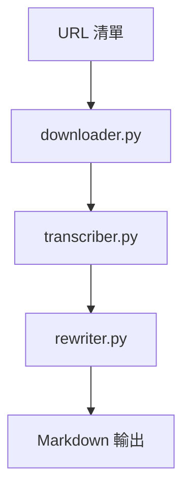

# Project Whisper

[](https://www.python.org/)
[](LICENSE)

將音訊自動轉為結構化 Markdown 文章：下載 → 轉錄（Whisper）→ 重寫（OpenRouter）→ 分類與輸出。

## 📋 概述

主要功能：
- 批次下載音訊（`yt-dlp`）
- 語音轉文字（Whisper）
- 文字重寫（OpenRouter + 可配置 Prompt）
- 智能檔案管理、自動分類與報告

核心設計要點：
- Prompt 來源優先序：`src/prompt.py` → `config/prompts/<type>.txt` → 後備 `general/finance`
- API 呼叫後自動冷卻 10 秒，降低 429 風險
- 檔名限制：保留原標題前 15 字，並去除 `_transcript` 後綴
- 未指定 `category` 且啟用自動分類時，依關鍵字分類輸出

## 🏗️ 架構



模組總覽：
- `downloader.py`：下載音訊與記錄 URL 狀態
- `transcriber.py`：Whisper 轉錄，輸出到 `data/output/transcripts/raw/`
- `rewriter.py`：OpenRouter 重寫成 Markdown；依 `prompt_type` 與 `category` 決定風格與存放目錄
- `file_manager.py`：統一路徑/檔案操作、分類、報告
- `cleaner.py`：清理舊結構與暫存

## 🚀 安裝

系統需求：Python 3.8+（可選 GPU/ROCm 加速 Whisper）

```bash
git clone <repository-url>
cd project-whisper
python -m venv venv
source venv/bin/activate  # Linux/Mac
# 或
venv\Scripts\activate     # Windows

# 安裝 ROCm 版 Torch (WSL2 範例，可依環境調整)
pip install torch torchvision torchaudio --extra-index-url https://download.pytorch.org/whl/rocm5.7

# 專案依賴
pip install -r requirements.txt
```

建立 `config.ini` 並填入（鍵名大小寫不敏感）：

```ini
[OPENROUTER]
API_KEY = your_api_key

[REWRITER]
PROMPT = finance
ENDPOINT = https://openrouter.ai/api/v1/chat/completions
MODEL = deepseek/deepseek-chat-v3-0324:free
auto_categorize_output = true

[transcriber]
model_name = base
```

WSL2/ROCm（可選）：安裝 `rocm-hip-sdk` 後以 `rocminfo` 驗證；依環境需求設定 `HSA_OVERRIDE_GFX_VERSION`。

## 📁 目錄結構

```
project-whisper/
├── data/
│   ├── input/{urls,audio/{raw,processed},config}
│   ├── output/{transcripts/{raw,cleaned},articles/{finance,technology,education,general},reports}
│   └── temp/{downloads,processing,cache}
├── config/prompts/{finance,technology,education,general}.txt
├── logs/
├── src/
└── main.py
```

## ▶️ 使用

1) 編輯 `data/input/urls/urls.txt`

2) 執行
```bash
python main.py
```

3) 輸出位置
- 轉錄：`data/output/transcripts/raw/`
- 文章：`data/output/articles/<category>/`
- 報告：`data/output/reports/`

指令參數：
- 指定分類/模板：`--category finance --prompt-type finance`
- 跳過下載：`--no-download`
- 僅清理：`--clean-only`
- 自訂 URL 檔：`--batch /path/to/urls.txt`

附註：程式會同時處理新下載且剛轉錄的檔案，以及既有 `data/output/transcripts/raw/` 內的所有逐字稿。

## ⚙️ 行為與 Prompt

Prompt 來源優先序：
1) `src/prompt.py` 的 `PROMPTS`
2) `config/prompts/<type>.txt`
3) 後備 `general` 或 `finance`

其他行為：
- API 呼叫後自動冷卻 10 秒，降低 429 風險
- 檔名保留原標題前 15 字，並去除 `_transcript`
- 未指定 `category` 且啟用自動分類時，依關鍵字分類輸出

## 🧪 測試與日誌

```bash
python test_system.py
```

日誌輸出於 `logs/`；主流程執行時自動建立日誌檔。

## 🆘 故障排除
- 驗證 `config.ini` 的 OpenRouter 金鑰
- 網路暢通但仍 429？重試前等待，或調整模型/頻率
- Whisper 模型未找到：依環境安裝對應 Torch/Whisper
- 檔案寫入問題：確認目錄權限與存在

## 🔮 後續規劃
- Web 介面、並行處理、更多 Prompt 與品質評估
- 可配置冷卻時間與檔名長度策略
- 多語言與 GUI

---

首次使用建議先執行 `python test_system.py` 確認環境設定正確。