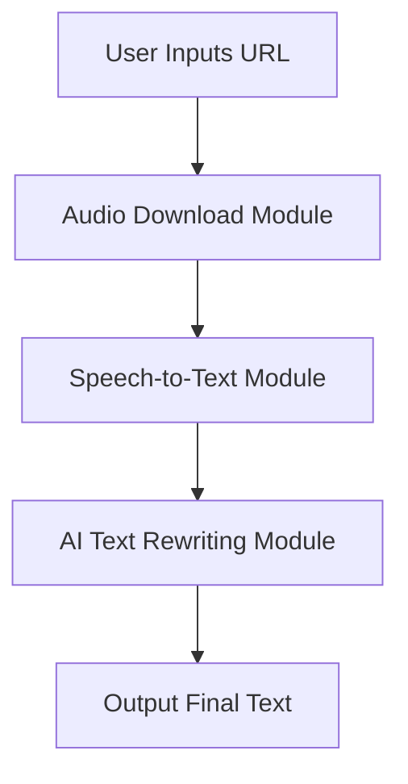

# Audio Processing and AI Rewriting System Development Plan

## Use Traditional Chinese

## System Architecture



## File Structure

```
project-whisper/
├── src/
│   ├── downloader.py    # Audio Download
│   ├── transcriber.py   # Speech-to-Text
│   ├── rewriter.py      # AI Text Rewriting
│   ├── cleaner.py       # Audio Cleaning
│   ├── utils.py         # Utility Functions
├── input/
│   └── (Input files for audio processing)
├── main.py              # Main Program
├── requirements.txt     # Dependency Packages
├── .gitignore
├── whisper/
```

## Implementation Steps

1. Environment Setup
    ```bash
    python -m venv venv
    source venv/bin/activate
    
    # Install ROCm-supported PyTorch (WSL2 environment)
    pip install torch torchvision torchaudio --extra-index-url https://download.pytorch.org/whl/rocm5.7
    
    # Install project dependencies
    pip install -r requirements.txt
    ```

    ### Install Compilation Dependencies (if whisper-cpp-python installation fails)
    ```bash
    sudo apt-get update
    sudo apt-get install cmake ninja-build
    ```
    
    ### WSL2 Environment Setup
    1. **Install ROCm Driver**:
       ```bash
       sudo apt update
       sudo apt install rocm-hip-sdk
       ```
    
    2. **Verify ROCm Installation**:
       ```bash
       rocminfo
       ```
    
    3. **Set Environment Variables**:
       ```bash
       echo 'export HSA_OVERRIDE_GFX_VERSION=10.3.0' >> ~/.bashrc
       source ~/.bashrc
       ```

2. Core Function Development
    - Audio Download Module: Supports YouTube and other platforms
    - Speech-to-Text: Uses Whisper model
    - Text Rewriting: Integrates OpenRouter API
    - Audio Cleaning Module: Processes cleaning of audio files
    - Utility Functions: Common functions for the project

3. Configuration Management
    - Create `.gitignore` to prevent leakage of sensitive information

4. Main Program Integration
    ```python
    from src.downloader import download_audio
    from src.transcriber import transcribe_audio
    from src.rewriter import rewrite_text

    def main():
        audio_path = download_audio(url)
        text = transcribe_audio(audio_path)
        rewritten = rewrite_text(text)
        # Save output...
    ```

## Dependency Packages

```requirements.txt
yt-dlp
openai-whisper
requests
configparser
```

## Future Optimization Directions
- Add batch processing functionality
- Include progress display
- Support multilingual translation
- Implement GUI interface