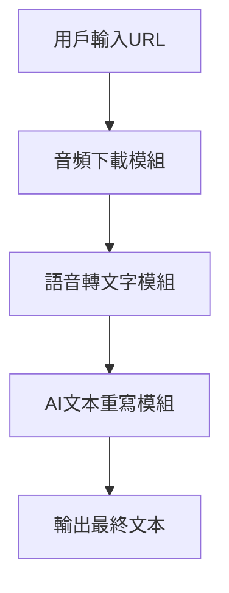

# 音頻處理與AI重寫系統開發計劃

##
- 使用繁體中文

## 系統架構


## 檔案結構
```
project-whisper/
├── src/
│   ├── downloader.py    # 音頻下載
│   ├── transcriber.py   # 語音轉文字
│   └── rewriter.py      # AI文本重寫
├── input/
│   └── urls.txt         # 輸入URL清單
├── output/
│   ├── audio/           # 音頻存儲
│   ├── text/            # 原始文字
│   └── rewritten/       # 重寫後文字
├── config.ini           # API金鑰配置
├── main.py              # 主程序
└── requirements.txt     # 依賴套件
```

## 實施步驟
1. 環境設置
   ```bash
   python -m venv venv
   source venv/bin/activate
   
   # 安装ROCm支持的PyTorch (WSL2环境)
   pip install torch torchvision torchaudio --index-url https://download.pytorch.org/whl/rocm5.7
   
   # 安装项目依赖
   pip install -r requirements.txt
   ```

   ### 安裝編譯依賴項 (如果 whisper-cpp-python 安裝失敗)
   ```bash
   sudo apt-get update
   sudo apt-get install cmake ninja-build
   ```
   
   ### WSL2环境设置
   1. **安装ROCm驱动**:
      ```bash
      sudo apt update
      sudo apt install rocm-hip-sdk
      ```
   
   2. **验证ROCm安装**:
      ```bash
      rocminfo
      ```
   
   3. **设置环境变量**:
      ```bash
      echo 'export HSA_OVERRIDE_GFX_VERSION=10.3.0' >> ~/.bashrc
      source ~/.bashrc
      ```

2. 核心功能開發
   - 音頻下載模組：支援YouTube等多平台
   - 語音轉文字：使用Whisper模型
   - 文本重寫：整合OpenRouter API

3. 配置管理
   - 創建`config.ini`儲存API金鑰
   - 添加.gitignore避免洩露敏感信息

4. 主程序整合
   ```python
   from src.downloader import download_audio
   from src.transcriber import transcribe_audio
   from src.rewriter import rewrite_text

   def main():
       audio_path = download_audio(url)
       text = transcribe_audio(audio_path)
       rewritten = rewrite_text(text)
       # 保存輸出...
   ```

## 依賴套件
```requirements.txt
yt-dlp
openai-whisper
requests
configparser
```

## 後續優化方向
- 增加批次處理功能
- 添加進度顯示
- 支援多語言翻譯
- 實現GUI界面